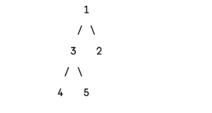
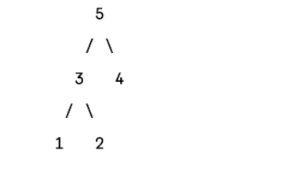

### 1 Introduction with Python

1.1 Python Basics <br>
1.2 Control Flow <br>
1.3 Functions <br>
1.4 OOP <br>
1.5 File Handling

### 2 Python data Arrangement formats

2.1 List ane Tupels <br>
2.2 Dictionaries adn Sets <br>
2.3 Ararys <br>

### 3 Data Structure

3.1 Introduction <br>
3.2 Linked List <br>
3.3 Stack <br>
3.4 Queue <br>
3.5 Hash <br>
3.6 Tree <br>
3.7 Graph <br>
3.8 Heap <br>

### 4 Algorithms

4.1 IIntroductions <br>
4.2 Time and Space Complexity <br>
4.3 Search Algorithms <br>
4.4 Divide and Conquer <br>
4.5 Sorting Algorithms <br>
4.6 Greedy Algorithms <br>
4.7 Back Tracking <br>
4.8 Graph Algorithm <br>

# Introduction to Python

### 1.1 Pythoin Basics

Python is a high level, interpreted programming language knows for its readability and simplicity. It's syntax allow developers to write code that is easy to understand and maintain. Python's versality
and wide range of libraries make it popular choice for various applications, including web development, data analysis, artificial intelligence, scientific computing, and more

#### 1.1.1 Variables and Data Types

In Python, variables are used to store data values. Unlike some other programming language, you don't need to declare a variable type in Python. Here are a few common data types you'll encounter:

- Integers: These are whole numbers, both positive and negative. For example:

```
 x = 5
 y = -3
```

- Floats: These are decimal point numbers. For example:

```
pi = 3.14
temperature = -5.0
```

- Strings: A swquence of characters enclosed in quotes. Single(' ') or double (" ") quotes can be used. For example:

```
name = "Alice"
greeting = 'Hello'
```

- Booleans: These represent True or False values. For example:

```
 is_valid = True
 is_completed = False
```

#### 1.1.2 Basic Operations

Python supports a wide range of operations that can be performed on its various data types. Here's brief overview:

 <ul>
  <li> Arithmetic Operations
  </li>
  <ul>
  <li> Addtion (+): result = c + y
  
  </li>
  <li> Subtraction (-): result = x - y</li>
  <li> Multiplication (*): result = x * y</li>
  <li> Division (/): result = x / y</li>
  <li> Modulus (%): result = x % y</li>
  </ul>
  <li>Comparison Operations:</li>
  <ul>
   <li> Equal to (==): is_equal = (x == y)</li>
   <li> Not equal to (!=): is_not_equal = (x != y)</li>
   <li> Greater than (>): is_greater = (x > y)</li>
   <li> Less than (<): is_lesser = (x < y)</li>
  </ul>
  <li>
    Logical Operations
  </li>
  <ul>
  <li> And (and): result = (x > 0) and (y < 10)</li>
  <li> Or (or): result = (x > 0) and (y < 0)</li>
  <li> Not (not): result = not (x > y)</li>
  </ul>
 </ul>

 #### 1.1.3 Input and Output
 Taking input from users and displaying output is fundamental in any programming language. Here's how it's done in Python:

- **Input**: The input() function is used to take input from the user. It always returns the input as a string. For example:

```python
    user_input = input("Enter your name: ")
    print("Hello, " + user_input + "!")
```

- **Output**: The **print()** function is used to display output. You can print text and variables. For example:

```python
 print("The value of x is:", x)
 print("Hello, World!")
```

### 1.2 Control Flow
Control flow is the order in which the individual statements, instructions, or function calls of a program are executed or evaluated. In Python, control flow is managed through conditionals, loops, and functions. By controlling the flow of the program, you can make decisions and execute code based on specific conditions.

#### 1.2.1 Conditional Statements
Conditional Statements allow you to execute certain parts of code based on whether a condition is true or false. The most commonly used conditional statements in  Python are if, elif, and else.

Syntax:
```python
    if condition:
        # Code to execute if the condition is true 
    elif another_condition:
        # Code to execute  if another_condition is true
    else:
        # Code to execute if none of the conditons are true
```
Example:
```python
    x = 10
    if x > 0:
        print("x is positive")
    elif x == 0:
        print("x is zero")
    else:
        print("x is negative")
```

#### 1.2.2 Loops
Loops are used to repeatedly execute a block of code as long as a condition is true.

- **For Loop**: A for loop is used for iterating over a sequence (such as a list, tuple, dictionary, set, or string).

Syntax:
```python
    for item in iterable:
        #code to execute for each item
```
Example:
```python
    fruits = ["apple", "banana", "cherry"]
    for fruit in fruits:
        print(fruit)
```
- **While Loop**: A while loop will repeatedly execute a block of code as long as the condition is true.

Synatx:
```python
    while condition:
        # Code to execute as long as the condition is true
```
Example:
```python
    i = 1
    while i < 6:
        print(i)
        i += 1
```

#### 1.2.3 Exception Handling
Exception handling is a way to handle errors gracefully in your program. Instead of your program crashing when an error occurs, you can use exception handling to catch the error and do something about it.

- **Try-Except Block**: The try block lets you test a block of code for errors, the except block lets you handle the error.

Syntax:
```python
    try:
        # Code that might raise an exception 
    except SomeException as e:
        # Code to handle t4e exception
    else:
        # Code to execute if no exception is raised
    finally:
        # Code that will always execute, regardless of an exception
```
Example:
```python
    try:
        x = 10 / 0
    except ZeroDivisionError as e:
        print("Cannot divide by zero:", e)
    else:
        print("No error occurred")
    finally:
        print("Execution completed")
```
### 1.3 Functions and Modules
Functions and modules are key components in Python that help in organizing and reusing code. Let's explore them in detail.

#### 1.3.1 Defining Functions
Functions in Python allow you to encapsulate a block of code that performs a specific task, amking it reusable and easier to manage.

Syntax:
```python
    def function_name(parameters):
        # code block
        return result
```
Example:
```python
    def greet(name):
        return f"Hello, {name}!"

    print(greet("Alice"))
```

#### 1.3.2 Importing Modules
Modules are files containing Python code (variables, functions, classes) that you can import and use in your programs. Python has a rich standard library, and you can also create your own modules.

Synatx
```python
    import module_name
```
Example
```python
    import math
    print(math.sqrt(16)) # Outputs: 4.0
```
- **Importing Specific Items**:
```python
    from math import sqrt
    print(sqrt(25)) # Outputs: 5.0
```
- **Importing with ALiases**:
```python
    import math as m
    print(m.sqrt(36)) # Outputs: 6.0
```

#### 1.3.3 Creating Your Own Modules
Creating your own modules is straightforward. You simply write Python code in a file and save it with a .py extension. Then, you can import this file as a module.

- **Create a file my_module.py**:
```python
    def add(a, b):
        return a + b
    def subtract(a, b):
        return a - b
```

- **Create a main program to use the module**:
```python
    import my_module

    print(my_module.add(5, 3)) # Outputs: 8
    print(my_module.subtract(5, 3)) # Outputs: 2
```

### 1.4 OOP
Object-Oriented Programming (OOP) is a programming paradigm that uses objects and classes to crate models based on the real world. It's useful for organizing complex programs, improving reusability, and enchancing code readability. By encapsulating data and functions into objects, OOP promotes modularity and helps in managing the complexity of software systems by allowing for code to be more easily maintained and extended

#### 1.4.1 Classes and Objects
**Classes** are blueprints for creating objects. A class defines a set of attributes and methods that the created objects will have. **Objects** are instances of a class.

Syntax:
```python
    class ClassName:
        # Attributes and methods 
        def __init__(self, attribute1, attribute2):
            self.attribute1 = attribute1
            self.attribute2 = attribute2
        def method(self):
            # Method definition
            pass
```
Example:
```python
    classs Dog:
        def __init__(self, name, breed):
            self.name = name
            self.breed = breed
        def bark(self):
            return f"{self.name} says woof!"

    my_dog = Dog("Buddy", "Golden Retriever")
    print(my_dog.bark())  # Outputs: Buddy says woof!
```

#### 1.4.2 Inheritance
Inheritance allows one class (child class) to inherit attributes and methods from another class (parent class). This promotes code reusability and hierachical classification, making it easier to manage and understand the code structure. It also supports polymorphism, enabling objects to be treated as instances of their parent class, which enhances flexibiltiy. Moreover, ingeritance helps in reducing redundancy by allowing common functionality to be defined in a base class.

Syntax:
```python
 class ParentClass:
    # Parent class definition
class ChildClass(ParentClass):
    # Child class definition
```
Example:
```python
    class Animal:
        def __init__(self, name):
            self.name = name
        def speak(self):
            pass
    
    class Dog(Animal):
        def speak(self):
            return f"{self.name} says woof!"
    
    class Cat(Animal):
        def speak(self):
            return f"{self.name} says meows!"
    

    dog = Dog("Buddy")
    cat = Cat("Whiskers")

    print(dog.speak()) # Outputs: Buddy says woof!
    print(cat.speak()) # Outputs: Whiskers says meow!
```

#### 1.4.3 Encapsulation
Encapsulation is the process of wrapping data (attributes) and methods into a single unit, a class. It also involves restricting access to certain details of an object.

```python
     class BankAccount:
        def __init__(self, balance):
            self.__balance = balance    # Private attribute
        def deposit(self, amount):
            self.__balance += amount
        def withdraw(self, amount):
            if amount <= self.__balance:
                self.__balance -= amount
            else:
                print("Insufficient funds")
        def get_balance(self):
            return self.__balance

    account = BankAccount(1000)
    account.deposit(500)
    account.withdraw(200)
    print(account.get_balance())  # Outps: 1300
```

#### 1.4.4 Polymorphism
Polymorphism allows methods to do different things based on the object it is acting upon, even though they share the same name.
```python
    class Bird:
        def fly(self):
            return "Birds can fly"
    class Penguin(Bird):
        def fly(self):
            return "Penguins cannot fly"

    bird = Bird()
    penguin = Penguin()
    print(bird.fly())  # Outputs: Birds can fly
    print(penguin.fly()) # Outputs: Penguins cannot fly
```

### 1.5 File Handling
File handling is an essential part of programming that allows you to read from, write to, and manipulate files on your system. It's crucial for various applications, such as data analysis, logging, and more.

#### 1.5.1 Reading Files
- **Opening a File**: To read file, you first need to open it. Python provides the *open()* function for this purpose. You can specify the mode in which you want to open the file- 'r' for reading, 'w' for writing, 'a' for appending, and 'b' for binary mode.

Syntax:
```python
    file = open('filename', 'mode')
```
Example:
```python
    file = open('example.txt', 'r')
    content = file.read()
    print(content)
    file.close()
```
- **Using the with statement**: The *with* statement is often used for file operations because it ensures that the file is properly closed after its suite finishes.

```python
    with open('example.txt', 'r') as file:
        content = file.read()
        print(content)
```
#### 1.5.2 Writing Files
- **Writing to a File**: To write to a file, you open it in write ('*w*') or append (*'a'*)mode. If the file doesn't exist, it will be created

```python
    with open('example.txt', 'w') as file:
        file.write("Hello, World!")
```

- **Appendign to a File**: Appending adds new content to the end of the file without overwriting existing content.
```python
    with open('example.txt', 'a') as file:
        file.write("\nThis is an appended line.")
```

#### 1.5.3 Working with CSV Files
CSV (Comma-Separated Values) files are commonly used for storing tabular data. Python provides the csv module to work with CSV files.

- **Reading CSV Files**:
```python
    import csv

    with open('data.csv', 'r') as file:
        reader = csv.reader(file)
        for row in reader:
            print(row)
```
- **Writing to CSV Files**:
```python
    import csv

    with open('data.csv', 'w', newline='') as file:
        writer = csv.writer(file)
        writer.writerow(['Name', 'Age', 'City'])
        writer.writerow(['Alice', 25, 'New York'])
        writer.writerow(['Bob', 30, 'San Francisco'])
```

- **Reading CSV Files into a Dictionary**: Sometimes, it's more convenient to read CSV data into a dictionary.

```python
    import csv

    with open('data.csv', 'r') as file:
        reader = csv.DictReader(file)
        for row in reader:
            print(dict(row))
```

- **Writing to CSV Files from a Dictionary**:
```python
    import csv

    data = [
        {'Name': 'Alice', 'Age': 25, 'City': 'New York'},
        {'Name': 'Bob', 'Age': 30, 'City': 'San Francisco'},
    ]

    with open('data.csv', 'w', newline='') as file:
        fieldName = ['Name', 'Age', 'City']
        writer = csv.DictWriter(file, fieldnames=fieldnames)

        writer.writeheader()
        for row in data:
            writer.writerow(row)
```

# PYTHON DATA ARRANGEMENT FORMATS
### 2.1 Lists and Tuples
Lists and tuples in Python are both used to store collections of items, but they serve slightly different purposes due to their inherent properties. Lists, which are enclosed in square brackets, are mutable, meaning that the contents can be changed after they are created. This flexibility allows for modifications such as adding, removing, or altering elements within the list. This makes lists particularly useful for scenarios where the data set needs to be dynamic or updated frequently. For example, lists are often used to store sequences of data that will change, such as user inputs, configurations that may need to be adjusted, or data that evolves over the course of a program's execution. The ability to change the list makes it versatile for a wide range of applications, from simple data aggregation to complex data manipulation tasks in various domains, including web development, data analysis, and machine learning.

On the other hand, tuples are enclosed in parentheses and are immutable, meaning once they are created, their contents cannot be altered. This immutability provides a form of integrity and security, ensuring that the data cannot be changed accidentally or intentionally, which can be crucial for maintaining consistent data states. Tuples are often used to represent fixed collections of items, such as coordinates, RGB colour values, or any data set that should remain constant throughout the program. The immutability of tuples can lead to more predictable and bug-free code, as developers can be certain that the data will not be altered. Additionally, because they are immutable, tuples can be used as keys in dictionaries, which require immutable types. This makes tuples suitable for scenarios where constant and unchanging data is necessary, enhancing both the readability and reliability of the code.

#### 2.1.1 Creating Lists and Tuples
- **Creating a List**: A list is created by placing all the items (elements) inside square brackets **[]**, separated by commas.

```python
    my_list = [1, 2, 3, 4, 5]
```

- **Creating a Tuple**: A tuple is created by placing all the items (elements) inside parentheses **()**, separated by commas.
```python
    my_tuple = (1, 2, 3, 4, 5)
```

#### 2.1.2 Basic Operations
Both lists and tuples support common operations such as indexing, slicing, and iteration.

- **Indexing**: You can access individual elements using an index. Indexing starts from 0.
```python
    print(my_list[0]) # Outputs: 1
    print(my_tuple [1]) # Outputs: 2 
```

- **Slicing**: You can access a range of elements using slicing.
```python
    print(my_list [1:3]) # Outputs: [2, 3]
    print(my_tuple [:4])
    # Outputs: (1, 2, 3, 4)
```
- **Iteration**: You can loop through the elements using a for loop.
```python
   for item in my_list:
     print(item)
   for item in my_tuple:
     print(item)
```

#### 2.1.3 List and Tuple Methods
Lists have several built-in methods that allow modification. Tuples, being immutable, have fewer methods.

- **List Methods**:
  - **append()** = Adds an item to the end of the list.
   ```python
        my_list.append(6)
        print(my_list) # Outputs: [1, 2, 3, 4, 5, 6]
   ```
   - **remove()**: Removes the first occurrence of an item.
```python
   my_list.remove (3)
  print(my_list)
  # Outputs: [1, 2, 4, 5, 6]
 ```

   - **insert()**: Inserts an item at a specified position.
 ```python
my_list.insert(2, 'a')
print(my_list) # Outputs:
[1, 2, 'a', 4, 5, 6]

 ```   

   - **pop()**: Removes and returns the item at a given position. If no index is specified, removes and returns the last item.
```python
my_list.pop()
print(my_list)
# Outputs:
[1, 2, 'a', 4, 5]
```

- Tuple Methods:
 - **count()**: Returns the number of times a specified value occurs in a tuple.
 ```python
print(my_tuple.count(2))
# Outputs: 1
 ```

 - **index()**: Searches the tuple for a specified value and returns the position of where it was found.
 ```python
print(my_tuple.index(3)) # Outputs: 2
 ```

### 2.2 Dictionaries and Sets
Dictionaries and sets are fundamental data structures in Python, each with distinct characteristics that make them suitable for different scenarios, especially in object-oriented programming and machine learning contexts. Dictionaries, often called associative arrays or hash maps in other programming languages, store data as key-value pairs, allowing for efficient data retrieval based on unique keys. This makes dictionaries particularly useful for tasks where quick lookup, insertion, and deletion of data are critical. For instance, dictionaries are invaluable in machine learning for managing datasets, where feature names (keys) are mapped to their values, or for storing model parameters and configurations. Their ability to handle complex data associations dynamically makes them a versatile tool in both data preprocessing and algorithm implementation.

Sets, on the other hand, are collections of unique elements, which makes them ideal for operations involving membership tests, duplicates removal, and mathematical operations like unions, intersections, and differences. In the context of machine learning, sets are often used to handle unique elements such as in feature selection processes, where ensuring that each feature is considered only once is crucial. Additionally, sets are employed to efficiently manage and analyze datasets by quickly identifying and eliminating duplicates, thus maintaining data integrity. Both dictionaries and sets contribute significantly to the robustness and efficiency of programming solutions, providing the tools needed to handle various data-centric tasks with precision and ease. Their distinct properties-dictionaries with their key-value mappings and sets with their uniqueness constraints complement each other and enhance the flexibility and performance of Python applications in both everyday programming and specialized fields like machine learning.


#### 2.2.1 Creating Dictionaries and Sets

- **Dictionaries**: Dictionaries are collections of key-value pairs. Each key maps to a specific value, and keys must be unique. Dictionaries are created using curly braces {} with a colon separating keys and values.
```python
my_dict={'name': 'Alice', 'age': 25, 'city': 'New
York'}
```

- **Sets**: Sets are unordered collections of unique elements. Sets are created using curly braces {} or the set() function.
```python
my_set = {1, 2, 3, 4, 5}
```

### 2.2.2 Basic Operations
 - **Dictionaries**:
 - **Accessing Values**
: You can access dictionary values using their keys.

```python
print(my_dict['name'])
# Outputs: Alice
```

- **Adding/Updating Elements**: You can add new key-value pairs or update existing ones.
```python
my_dict['age'] = 26 # Updates age to 26
```

- **Removing Elements**: You can remove elements using the del statement or pop() method.
```python
del my_dict['city'] # Removes the key 'city'
```

- **Sets**:
- **Adding Elements**: Use the add () method to add elements to a set.
my_set.add(6) # Adds 6 to the set
```python
my_set.add(6) # Adds 6 to the set
```

- **Removing Elements**: Use the remove() or discard() method to remove elements.
```python
my_set.remove(3) # Removes 3 from the set
```

- **Set Operations**: Sets support mathematical operations like union, intersection, and difference.
```python
another_set = {4, 5, 6, 7}
= union_set 4, 5, 6, 7} my_set.union (another_set) # {1, 2, 3, 4, 5, 6, 7}
```

### 2.2.3 Dictionary and Set Methods

- **Dictionary Methods**:
- **keys()**: Returns a view object that displays a list of all the keys in the dictionary.
```python
print(my_dict.keys())
# Outputs: dict_keys(['name', 'age'])
```
- **values()**: Returns a view object that displays a list of all the values in the dictionary.
```python
print(my_dict.values()) dict_values(['Alice', 26])
# Outputs: dict_values(['Alice', 26])
```

- **items()**: Returns a view object that displays a list of dictionary's key-value tuple pairs.
```python
print(my_dict.items())
# Outputs: dict_items([('name', 'Alice'), ('age', 26)])
```

- **Set Methods**:

- **union()**: Returns a new set containing all elements from both sets.
```python
union_set = my_set.union (another_set) # {1, 2, 4, 5, 6, 7}
```

- **intersection()**: Returns a new set containing only elements that are common to both sets.
```python
intersection_set = my_set.intersection(another_set) # {4, 5}
```

- **difference()**: Returns a new set containing elements that are in the first set but not in the second.
```python
difference_set = my_set.difference (another_set) # {1, 2}
```

## 2.3 Arrays
Arrays are one of the most fundamental data structures in computer science. They provide a way to store a fixed-size sequential collection of elements of the same type. Arrays are widely used because they offer efficient access to elements by their index and support various operations that are foundational for many algorithms.

### 2.3.1 Creating Arrays in Python
The closest native data structure to arrays is the list, but for more efficiency with numerical operations, the array module or NumPy arrays are often used.

- **Using the array Module**:
```python
import array
# Creating an array of integers
arr = array.array('i', [1, 2, 3, 4, 5])
print(arr) # Outputs: array('i', [1, 2, 3, 4, 5])
# Accessing elements by index
print(arr[0]) # Outputs: 1
# Modifying elements
arr[1] = 10
print(arr) # Outputs: array('i', [1, 10, 3, 4, 5])

```
- **Using NumPy Arrays**:
```python
import numpy as np

# Creating a NumPy array
arr = np.array([1, 2, 3, 4, 5])
print(arr) # Outputs: [12345]
# Accessing elements by index
print(arr[0]) # Outputs: 1
# Modifying elements
arr[1] = 10 print(arr) # Outputs:
[ 1 10 3 4 5]

# Performing operations on arrays
print(arr + 2) # Outputs: [ 3 12 5 6 7]
* print(arr 2) # Outputs: [ 220 6 8 10]
```

### 2.3.2 Applications of Arrays in Algorithms

- **Sorting Algorithms**: Arrays are often used in sorting algorithms such as Quick Sort, Merge Sort, and Bubble Sort. Sorting algorithms typically operate on arrays due to their efficient access and modification capabilities.

- **Searching Algorithms**: Arrays are used in searching algorithms such as
Linear Search and Binary Search. Arrays provide a straightforward way to store data sequentially, making it easier to search through them.

- **Dynamic Programming**: Arrays are crucial in dynamic programming to
store intermediate results and avoid redundant calculations. This helps in optimizing the time complexity of algorithms.

# DATA STRUCTURE

## 3.1 Introduction
Data structures are specialized formats for organizing, processing, and storing data.

### 3.1.1 Primitive Data Structures:
These are basic structures that hold single values. They are the simplest form of data storage.

- Integers
- Floats
- Characters
- Booleans

### 3.1.2 Non-Primitive Data Structures:
These are more complex structures that can hold multiple values and can be used to store collections of data.

- **Linear** : These data structures store data in a linear or sequential order. Every element has a single predecessor and a single successor (except the first and last elements).

- Arrays
- Linked List
- Stacks
- Queues

- **Non-Linear Data Structures**: These data structures store data in a
hierarchical manner and do not necessarily follow a sequential order. Each element can be connected to multiple elements, reflecting complex relationships.

- Trees
- Graphs

## 3.2 Linked List
A **linked list** is a linear data structure where elements are stored in nodes. Each node contains two parts: data and a reference (or link) to the next node in the sequence.

- **Singly Linked List**
- **Doubly Linked List**
- **Circular Linked List**

### 3.2.1 Singly Linked List
Each node in a singly linked list points to the next node. The last node points to null, indicating the end of the list.

```python
class Node:
    def __init__(self, data):
        self.data = data
        self.next = None
class Singly LinkedList:
    def __init__(self):
        self.head = None
```

### 3.2.2 Doubly Linked List
Each node has two references: one to the next node and another to the previous node.
This allows traversal in both directions.

```python
class Node:
    def __init__(self, data):
        self.data = data
        self.next = None
        self.prev = None
class Doubly LinkedList:
    def __init__(self):
        self.head = None
```

### 3.2.3 Circular Linked List
In a circular linked list, the last node points back to the first node, forming a circle. It can be singly or doubly linked.

**(Using Singly Circular)**
```python
class Node:
    def __init__(self, data):
        self.data = data
        self.next = None
class Circular LinkedList:
    def __init__(self):
        self.head = None
```

### 3.2.4 Memory Usage

- **Singly Linked List** : Requires memory for the data and a pointer to the next node.

- **Doubly Linked List** : Requires memory for the data, a pointer to the next node, and a pointer to the previous node.

- **Circular Linked List** : Similar to singly or doubly linked lists in memory usage, but with the last node pointing back to the first node.

## 3.3 Stack
A **stack** is a linear data structure that follows a particular order for operations. The order may be LIFO (Last In First Out) or FILO (First In Last Out).

```python
class Stack:
    def __init__(self):
        self.items = []
    def push (self, item):
        self.items.append(item)
    def pop(self):
        if not self.is_empty():
            return self.items.pop()
    def peek(self):
        if not self.is_empty():
            return self.items[-1]
    def is_empty(self):
        return len(self.items) == 0
    def size(self):
        return len(self.items)

# Example usage
stack = Stack()
stack.push(1)
stack.push(2)
stack.push(3)
print(stack.peek())
# Output: 3
print(stack.pop())
# Output: 3
print(stack.pop())
# Output: 2
print(stack.size())
# Output: 1
```

### 3.3.1 LIFO Principle
The LIFO (Last In, First Out) principle means that the last element added to the stack will be the first one to be removed. Think of it like a stack of plates: the last plate placed on top is the first one to be taken off.

### 3.3.2 Common Operations
- **Push** :
- Adds an element to the top of the stack.

- Time Complexity: O(1) (since adding an element to the end of the list is a constant-time operation).

- **Pop** :
- Removes and returns the top element of the stack.

- Time Complexity: O(1) (since removing an element from the end of the list is a constant-time operation).

- **Peek:** :
- Returns the top element of the stack without removing it.

- Time Complexity: O(1) (since accessing the last element of the list is a constant-time operation).

### 3.3.3 Memory Usage
Memory usage for a stack is generally O(n), where n is the number of elements in the stack. This is because we need to store each element in memory.

## 3.4 Queue
A **queue** is a linear data structure that follows the First In, First Out (FIFO) principle. This means that the first element added to the queue will be the first one to be removed.

- **Simple Queue**
- **Circular Queue**
- **Priority Queue**

### 3.4.1 FIFO Principle
The **FIFO (First In, First Out)** principle is analogous to a line of people at a ticket counter. The first person to join the line is the first one to be served and leave the line.


### 3.4.2 Simple Queue
A simple queue operates on the FIFO principle. Elements are added at the rear and removed from the front.

```python
class SimpleQueue:
    def __init__(self):
        self.queue = []
    def enqueue(self, item):
        self.queue.append(item)
    def dequeue(self):
        if not self.is_empty():
            return self.queue.pop(0)
    def is_empty(self):
        return len(self.queue) == 0
    def front(self):
        if not self.is_empty():
            return self.queue[0]

# Example usage
= queue SimpleQueue()
queue.enqueue (1)
queue.enqueue (2)
queue.enqueue (3)
print(queue.front())
# Output: 1
print(queue.dequeue())
# Output: 1
print(queue.dequeue())
# Output: 2
print(queue.is_empty())
# Output: False
```

### 3.4.3 Circular Queue
In a circular queue, the last position is connected back to the first position to form a circle. This improves the utilization of space.

```python
class Circular Queue:
    def __init__(self, size):
        self.queue = [None] * size
        self.max_size = size
        self.front = -1
        self.rear = -1
    def enqueue(self, item):
        if((self.rear + 1) % self.max_size == self.front)
            print("Queue is full")
        elif self.front == -1:
            self.front = 0
            self.rear = 0
            self.queue[self.rear] = item
        else:
            self.rear = (self.rear+ 1) % self.max_size
            self.queue[self.rear] = item
    def dequeue(self):
        if self.front == -1:
            print("Queue is empty")
        elif self.front == self.rear:
            temp = self.queue[self.front]
            self.front = -1
            self.rear = -1
            return temp
        else:
            temp = self.queue [self.front]
            self.front = (self.front + 1) % self.max_si
            return temp
    def is_empty(self):
        return self.front == -1
    def front(self):
        if self.is_empty():
        return None
        return self.queue[self.front]

# Example usage
circular_queue = Circular Queue (5)
circular_queue.enqueue (1)
circular_queue.enqueue (2)
circular_queue.enqueue (3)
print(circular_queue.front()) # Output: 1
print(circular_queue.dequeue())
# Output: 1
print(circular_queue.dequeue())
# Output: 2
print(circular_queue.is_empty())
# Output: False
```

### 3.4.4 Priority Queue
In a priority queue, elements are removed based on their priority, not just their position in the queue. Higher priority elements are dequeued before lower priority elements.

```python
import heapq

class Priority Queue:
    def __init__(self):
         self.queue []
    def enqueue(self, item, priority):
        heapq.heappush(self.queue, (priority, item))
    def dequeue (self):
        if not self.is_empty():
            return heapq.heappop(self.queue) [1]
    def is_empty(self):
        return len(self.queue) == 0
    def front(self):
        if not self.is_empty():
            return self.queue[0][1]

# Example usage
priority_queue PriorityQueue()
priority_queue.enqueue('A', 2)
priority_queue.enqueue('B', 1)
priority_queue.enqueue('C', 3)
print(priority_queue.front())
# Output: B
print(priority_queue.dequeue()) # Output: B
print(priority_queue.dequeue())
# Output: A
print(priority_queue.is_empty())
# Output: False
```

## 3.5 Hash
A **hash table** is a data structure that maps keys to values. It uses a hash function to compute an index into an array of buckets or slots, from which the desired value can be found. Hash tables are highly efficient for lookups, insertions, and deletions.

```python
def simple_hash(key, size):
    return hash(key) % size
    

size = 10
index = simple_hash ("example", size)
print(index) # This will print the index for the key "example"
```

### 3.5.1 Hashing Mechanisms
**Hashing** is the process of converting a given key into a unique index. The hash function processes the input and returns a fixed-size string or number that typically serves as an index in the array.

### 3.5.2 Collision Resolution Techniques
Since multiple keys can hash to the same index (a situation known as a collision), we need ways to handle these collisions. The two primary techniques are **chaining** and **open addressing**.

- **Chaining** : In chaining, each bucket contains a linked list (or another secondary data structure) of all elements that hash to the same index. This way, multiple values can be stored at each index.

- **Open Addressing** : In open addressing, when a collision occurs, the
algorithm searches for the next available slot within the table itself. There are several strategies for open addressing, including linear probing, quadratic probing, and double hashing.

## 3.6 Tree
A **tree** is a non-linear hierarchical data structure that consists of nodes connected by edges. Each node contains a value, and nodes are organized in a hierarchical manner. The topmost node is called the root, and each node has zero or more child nodes.

- **Binary Tree**
- **Binary Search Tree (BST)**

### 3.6.1 Binary Tree
A binary tree is a type of tree where each node has at most two children, referred to as the left child and the right child.

```python
class Node:
    def __init__(self, data):
        self.data = data
        self.left = None
        self.right = None
class BinaryTree:
    def __init__(self):
        self.root = None
```

### 3.6.2 Binary Search Tree (BST)
A **binary search tree (BST)** is a binary tree with the additional property that for any
given node, the value of the left child is less than the value of the node, and the value of the right child is greater than the value of the node. This property makes searching operations efficient.

```python
class Node:
    def __init__(self, data):
        self.data = data
        self.left = None
        self.right = None
class BinarySearchTree:
    def __init__(self):
        self.root = None
    def insert(self, data):
        if self.root is None:
            self.root = Node(data)
        else:
            self._insert(self.root, data)
    def _insert(self, current_node, data):
        if data current_node.data:
            if current_node.left is None:
                current_node.left = Node(data)
            else:
                self._insert(current_node.left, data)
        elif data > current_node.data:
                if current_node.right is None:
                    current_node.right = Node(data)
                else:
                    self._insert(current_node.right, data)
```

### 3.6.3 Traversal Method
Tree traversal methods are used to visit all the nodes in a tree and perform an operation (e.g., printing the node's value) on each node. The three common traversal methods for binary trees are **in-order, pre-order,** and **post-order**.

- **In-order Traversal** :

- Traverse the left subtree
- Visit the root node
- Traverse the right subtree

- **Pre-order Traversal** :
- Visit the root node
- Traverse the left subtree
- Traverse the right subtree

- **Post-order Traversal** :
- Traverse the left subtree
- Traverse the right subtree
- Visit the root node


## 3.7 Graph
A **graph** is a data structure that consists of a finite set of vertices (or nodes) and a set of edges connecting them. Graphs are used to model pairwise relations between objects.

- **Directed Graph**
- **Undirected Graph**

### 3.8.1 Directed Graph (Digraph)
In a directed graph, edges have a direction. This means that each edge is an ordered pair of vertices, representing a one-way relationship.

```python
A -> B -> C
```

In this example, you can go from A to B and from B to C, but not the other way around.

### 3.7.2 Undirected Graph
In an **undirected graph**, edges do not have a direction. Each edge is an unordered pair of vertices, representing a two-way relationship.

```python
A - B - C
```

In this example, you can travel between A and B or B and C in either direction.

### 3.8.3 Representation
Graphs can be represented in several ways, with the most common being the **adjacency matrix** and **adjacency list**.

- **Adjancency Matrix** : An adjacency matrix is a 2D array of size V x V where V is the number of vertices. If there is an edge from vertex i to vertex j, then the matrix at position (i, j) will be 1 (or the weight of the edge if it's weighted). Otherwise, it will be 0.

- **Adjacency List** : An adjacency list is an array of lists. The array size is equal to the number of vertices. Each entry i in the array contains a list of vertices to which vertex i is connected.

## 3.8 Heap
A **heap** is a specialized tree-based data structure that satisfies the heap property. In a heap, for every node i, the value of i is either greater than or equal to (in a max-heap) or less than or equal to (in a min-heap) the value of its children, if they exist.

### 3.9.1 Min-Heap vs Max-Heap

- **Min-Heap** : In a min-heap, the value of the parent node is always less than or equal to the values of its children. The root node has the smallest value.



- **Max-Heap** : In a **max-heap**, the value of the parent node is always greater than or equal to the values of its children. The root node has the largest value



### 3.8.2 Common Operations

- **Insert** : Inserting an element into a heap involves adding the new element to the end of the heap and then restoring the heap property by comparing the new element with its parent and swapping if necessary. This process is called "**heapifying up**".

```python
class MinHeap:
    def __init__(self):
        self.heap = []
    def insert(self, key):
        self.heap.append(key)
        self._heapify_up(len(self.heap) -1)
    def _heapify_up(self, index):
        parent_index = (index 1)  # 2
            if index > 0 and self.heap[index] < self.heap[parent_index]:
                self.heap[index],
                self.heap[parent_index] = self.heap[parent_index],
                self.heap[index]
                self._heapify_up (parent_index)

# Example usage
min_heap MinHeap()
min_heap.insert(3)
min_heap.insert(1)
min_heap.insert(6)
min_heap.insert(5)
print(min_heap.heap)
# Output: [1, 3, 6, 5]
```
- **Delete (Extract Min/Max)** : Deleting the root element from a heap involves
removing the root and replacing it with the last element in the heap. The heap property is then restored by comparing the new root with its children and swapping if necessary. This process is called "**heapifying down**".

    **(Max-Heap)**

```python
def delete_min(self):
    if len(self.heap) == 0:
        return None
    if len(self.heap) == 1:
        return self.heap.pop()
    root = self.heap[0]
    self.heap[0] = self.heap.pop()
    self._heapify_down (0)
    return root

def _heapify_down(self, index):
    smallest = index
    left_child * = 2 index + 1
    right_child = 2 * index + 2
    if left_child self.heap[left_child] < self.heap [smallest]: < len(self.heap) and self.heap[left_child] < self.heap [smallest]:
        smallest = left_child
        if right_child < len(self.heap) and self.heap[right_child] < self.heap[smallest]:
smallest = right_child
if smallest != index:
    self.heap[index], self.heap[smallest] self.heap[smallest], self.heap[index] = self._heapify_down (smallest)

```

- **Peek** : Peeking at the heap returns the root element without removing it. In a min-heap, this is the smallest element; in a max-heap, this is the largest element.

```python
def peek(self):
    if len(self.heap) > 0:
    return self.heap[0]
return None
```

# ALGORITHMS

## 4.1 Introduction
An algorithm is a step-by-step procedure or formula for solving a problem. They are essential building blocks in computer science and are used to automate tasks and solve complex problems efficiently.

- **Search Algorithms**
- **Divide and Conquer**
- **Sorting Algorithms**
- **Greedy Algorithms**
- **Backtracking**
- **Graph Algorithms**
- **Bit Manipulation**

## 4.2 Time and Space Complexity
Time and space complexity are metrics used to analyze the efficiency of an algorithm. They help us understand how the algorithm performs as the input size grows.

- **Time Complexity** : This measures the amount of time an algorithm takes to complete as a function of the size of the input. It's usually expressed using Big O notation (e.g., O(n), O(log n)), which gives an upper bound on the growth rate.

- **Space Complexity** : This measures the amount of memory an algorithm uses in relation to the size of the input. Like time complexity, it's also expressed using Big O notation.

### 4.2.1 Why is it Necessary?
Understanding time and space complexity is crucial for several reasons:

- **Efficiency** : Helps in choosing the most efficient algorithm for a given problem.

- **Scalability** : Ensures that the algorithm can handle large inputs.

- **Optimization** : Helps in identifying potential bottlenecks and optimizing the code.

- **Resource Management** : Ensures efficient use of computational resources.

### 4.2.3 How to Calculate Time and Space Complexity?
Let's consider an example in Python to illustrate this.

**Calculating the Sum of a List*** :
```python
def sum_of_list(nums):
    total = 0 # 0(1) space
    for num in nums: # Loop runs 'n' times, where 'n' i the length of the list
        total += num  #O(1) space for the addition
    return total # O(1) time

# Example usage
numbers = [1, 2, 3, 4, 5]
result = sum_of_list(numbers)
print(result)
```

**Time Complexity Analysis**:

- **Initialization** : total = 0 takes constant time, O(1).

- **Loop** : The loop runs 'n' times, where 'n' is the length of the list, so this is O(n).
- **Addition** : Adding each element takes constant time, O(1).
Overall, the time complexity is **O(n)**.

**Space Complexity Analysis**:
- **Variables** : total uses O(1) space.
- **Input list** : The input list nums itself takes O(n) space.
Overall, the space complexity is **O(n)**.

## 4.3 Search Algorithms
Used to search for an element within a data structure.
- **Linear Search**
- **Binary Search**
- **Depth-First Search (DFS)**
- **Breadth-First Search (BFS)**

### 4.3.1 Linear Search
Linear search is the simplest search algorithm. It checks every element in the list sequentially until the target value is found or the list ends.

```python
def linear_search(arr, target):
    for i in range(len(arr)):
        if arr[i] == target:
        return i # Return the index of the target
    return -1 % Return -1 if the target is not found

# Example usage
arr = [3, 5, 1, 4, 2]
target = 4
print(linear_search(arr, target)) # Output: 3
```

### 4.3.2 Binary Search
**Binary search** is an efficient algorithm for finding an item from a sorted list of items. It works by repeatedly dividing the search interval in half.

```python
def binary_search(arr, target):
    left, right = 0, len(arr) 1
    while left <= right:
        mid = (left + right) // 2
        if arr[mid] == target:
            return mid # Return the index of the target

        elif arr[mid] < target: 
            left = mid 1
        else:
            right = mid 1
            return -1 # Return -1 if the target is not found
# Example usage
arr = [1, 2, 3, 4, 5]
target = 3
print(binary_search(arr, target)) # Output: 2
```

### 4.3.3 Depth-First Search (DFS)
**Depth-first search (DFS)** is a graph traversal algorithm that starts at the root node and explores as far as possible along each branch before backtracking.

```python
def dfs(graph, start, visited=None):
    if visited is None:
        visited = set()
    visited.add(start)
    print(start, end=' ')
    for neighbor in graph [start]:
        if neighbor not in visited:
            dfs(graph, neighbor, visited)
# Example usage
graph = {
'A': ['B', 'C'],
'B': ['D', 'E'],
'C': ['F'].
'D': [].
'E': ['F'].
'F': []
}
dfs(graph, 'A') # Output: ABDEFC
```

### 4.3.4 Breadth-First Search (BFS)
**Breadth-first search (BFS)** is a graph traversal algorithm that starts at the root node and explores all neighbors at the present depth before moving on to nodes at the next depth level.

```python

from collections import deque
def bfs (graph, start):
    visited set()
    queue = deque ([start])
    visited.add(start)
    while queue:
        vertex = queue.popleft()
        print(vertex, end=' ')
        for neighbor in graph[vertex]:
            if neighbor not in visited:
                visited.add(neighbor)
                queue.append(neighbor)

# Example usage
graph = {
'A': ['B', 'C'],
'B': ['D', 'Ε'],
'C': ['F'].
'D': [],
'E': ['F'].
'F': []
}
bfs (graph, 'A') # Output: ABCDEF
```

## 4.4 Divide and Conquer
**Divide and Conquer** is an algorithmic paradigm that involves breaking a problem into smaller subproblems, solving each subproblem independently, and then combining their solutions to solve the original problem. This approach is particularly effective for problems that can be recursively divided into similar subproblems.

- **Merge Sort**
- **Quick Sort**
- **Binary Search**
### 4.4.1 Steps in Divide and Conquer
- **Divide** : Break the problem into smaller subproblems of the same type.
- **Conquer** : Solve the subproblems recursively.
- **Combine** : Merge the solutions of the subproblems to get the solution to the original problem.

## 4.5 Sorting Algorithms
Used to arrange data in a particular order.

- **Bubble Sort**
- **Merge Sort**
- **Quick Sort**

### 4.5.1 Bubble Sort
**Bubble Sort** is a simple comparison-based sorting algorithm. It works by repeatedly stepping through the list, comparing adjacent elements, and swapping them if they are in the wrong order. This process is repeated until the list is sorted.

```python
def bubble_sort(arr):
    n = len(arr)
    for i in range(n):
        for j in range(0, n-i-1):
            if arr[j] > arr[j+1]:
            arr[j], arr[j+1] = arr[j+1], arr[j]
    return arr
# Example usage
arr [64, 34, 25, 12, 22, 11, 90] =
print(bubble_sort(arr)) # Output: [11, 12, 22, 25, 34, 64,901
```

**Time Complexity** :
- **Worst and Average Case** : O(n²)
- **Best Case** : O(n) (when the array is already sorted)

### 4.5.2 Merge Sort
**Merge Sort** is a divide and conquer algorithm. It divides the input array into two halves, calls itself for the two halves, and then merges the two sorted halves.

```python
def merge_sort(arr):
    if len(arr) > 1:
    mid len(arr) # 2
    left_half = arr[:mid]
    right_half = arr[mid:]
    merge_sort(left_half)
    merge_sort(right_half)
    i = j = k = 0
while i < len(left_half) and j < len(right_half):
    if left_half[i] < right_half[j]:
        arr[k] = left_half[i] 
        i += 1 
    else: 
        arr[k] = right_half[j]
        j += 1
    k += 1
    
    while i < len (left_half):
         arr[k] = left_half[i]
        i += 1
        k += 1

    while j < len(right_half):
         arr[k] = right_half[j] 
         j += 1
       
         k += 1
return arr

# Example usage
arr = [38, 27, 43, 3, 9, 82, 10]
print(merge_sort(arr)) # Output: [3, 9, 10, 27, 38, 43, 82]
````

**Time Complexity** :
- **Worst, Average, and Best Case** : O(n log n)

### 4.5.3 Quick Sort
Quick Sort is a divide and conquer algorithm. It selects a 'pivot' element and partitions the array around the pivot, such that elements on the left of the pivot are less than the pivot and elements on the right are greater. The process is then recursively applied to the sub-arrays. This leads to an efficient sorting process with an average time complexity of O(n log n). Additionally, Quick Sort is often faster in practice due to its efficient cache performance and reduced overhead from fewer memory writes compared to other sorting algorithms like Merge Sort.

```python
def partition(arr, low, high):
    pivot = arr[high]
    i = low - 1
    for j in range (low, high):
        if arr[j] <= pivot:
            i += 1
            arr[i], arr[j] = arr[j], arr[i]
    arr[i + 1], arr[high] = arr[high], arr[i + 1]
    return i + 1

def quick_sort(arr, low, high):
    if low high:
        pi = partition (arr, low, high)
        quick_sort(arr, low, pi -1)
        quick_sort(arr, pi 1, high)
    return arr

# Example usage
arr = [10, 7, 8, 9, 1, 5]
print(quick_sort(arr, 0, len(arr)- 1))  # Output: [1,5, 7, 8, 9, 10]
```


**Time Complexity** :
- **Worst Case** : O(n²) (when the pivot is the smallest or largest element)
- **Average and Best Case** : O(n log n)

## 4.6 Greedy Algorithms
**Greedy algorithms** are a type of algorithmic paradigm that makes a series of choices by selecting the best option available at each step. The goal is to find an overall optimal solution by making a locally optimal choice at each stage.

### 4.6.1 Prim's Algorithm
**Prim's algorithm** is a greedy algorithm that finds the Minimum Spanning Tree (MST) for a weighted undirected graph. The MST is a subset of the edges that connects all vertices in the graph with the minimum total edge weight and without any cycles.

```python
import heapq
def prims_algorithm (graph, start):
    mst = []
    visited = set()
    min_heap = [(0, start)] # (weight, vertex)
    while min_heap:
        weight, current_vertex = heapq.heappop(min_heap)
        if current_vertex in visited:
            continue
        visited.add(current_vertex)
        mst.append((weight, current_vertex))
        for neighbor, edge_weight in graph [current_vertex]:
            if neighbor not in visited:
                heapq.heappush(min_heap, (edge_weight, neighbor))
    return mst

# Example usage
graph = {
'A': [('B', 1), ('C', 3)],
'B': [('A', 1), ('C', 7), ('D', 5)],
'C': [('A', 3), ('B', 7), ('D', 12)],
'D': [('B', 5), ('C', 12)]
}
mst = prims_algorithm (graph, 'A')
print(mst) # Output: [(0, 'A'), (1, 'B'), (5, 'D'), (3,'C')]
```

**Steps of Prim's Algorithm** :
 - Initialize a tree with a single vertex, chosen arbitrarily from the graph.
- Grow the tree by one edge: choose the minimum weight edge from the graph that connects a vertex in the tree to a vertex outside the tree.
- Repeat step 2 until all vertices are included in the tree.


## 4.7 Backtracking
**Backtracking** is an algorithmic paradigm that tries to build a solution incrementally, one piece at a time. It removes solutions that fail to meet the conditions of the problem at any point in time (called constraints) as soon as it finds them. Backtracking is useful for solving constraint satisfaction problems, where you need to find an arrangement or combination that meets specific criteria.

**N-Queen's Algorithm**

### 4.7.1 N-Queen's Algorithm
The N-Queens problem involves placing N queens on an N×N chessboard so that no two queens threaten each other. This means no two queens can share the same row, column, or diagonal. This classic problem is a perfect example of a backtracking algorithm. Solutions are found by placing queens one by one in different columns, starting from the leftmost column, and backtracking when a conflict is detected.

```python
def is_safe (board, row, col, N):
    for i in range(col):
        if board[row] [i] == 1:
            return False
    for i, jin zip (range (row, 1, 1), range (col, -1, -1)):
        if board[i][j] == 1:
            return False
    for i, jin zip (range (row, N. 1), range(col, -1, -1)):
        if board[i][j] == 1:
            return False
    return True
def solve_n_queens_util(board, col, N):
        if col >= N:
            return True
        for i in range(N):
            if is_safe (board, i, col, N):
                board[i][col] = 1
                if solve_n_queens_util(board, col 1, N):
                    return True
                board[i][col] = 0 # Backtrack
        return False

def solve_n_queens (N):
    board = [[0] N for in range(N)] -
    if not solve_n_queens_util(board, 0, N):
        return "Solution does not exist"
    return board

# Example usage
N = 4
solution = solve_n_queens (N)
for row in solution:
    print(row)

Output:
[0, 0, 1, 0]
[1,0,0,0]
[0,0,0,1]
[0,1,0,0]
```

## 4.8 Graph Algorithm
Graph algorithms are used to solve problems related to graph theory, which involves vertices (or nodes) and edges connecting them. These algorithms help in understanding and manipulating the structure and properties of graphs. Here are some of the most important graph algorithms:

**Dijkstra's Algorithm**


### 4.8.1 Dijkstra's Algorithm
**Dijkstra's algorithm** is used to find the shortest path from a source vertex to all other vertices in a graph with non-negative edge weights. It uses a priority queue to repeatedly select the vertex with the smallest distance, updates the distances of its neighbors, and continues until all vertices have been processed.

```python
import heapq

def dijkstra (graph, start):
    distances = {vertex: float('infinity') for vertex in graph}
    distances [start] = 0
    priority_queue  = [(0, start)]
    while priority_queue:
        current_distance, current_vertex = heapq.heappop (priority_queue)
        if current_distance > distances [current_vertex]:
            continue
        for neighbor, weight in graph[current_vertex]:
            distance = current_distance + weight
            if distance < distances [neighbor]:
                distances [neighbor] = distance
                heapq.heappush (priority_queue, (distance, neighbor))
    return distances
# Example usage
graph = {
'A': [('B', 1), ('C', 4)],
'B': [('A', 1), ('C', 2), ('D', 5)],
'C': [('A', 4), ('B', 2), ('D', 1)],
'D': [('B', 5), ('C', 1)]
}

start_vertex = 'A'
print(dijkstra (graph, start_vertex)) # Output: {'A': 0, 'B': 1, 'C': 3, 'D': 4}
```

### 4.8.2 Steps of Dijkstra's Algorithm
 - **Initialise**: Set source vertex distance to 0; all other vertices to infinity. Add source vertex to the priority queue with distance 0.
 - **Relaxation**: Extract vertex with minimum distance. For each neighbor, update distances if a shorter path is found, and add neighbor to priority queue.
 - **Repeat**: Keep extracting the minimum distance vertex and updating neighbors until the priority queue is empty.


 # CONCLUSION
 In this enriching exploration of data structures and algorithms, a profound understanding has been unearthed, weaving a tapestry of computational elegance. The journey commenced with the foundations of linked lists, where the fluid interplay of singly, doubly, and circular variations showcased the graceful management of dynamic data. Through the orchestration of stacks and queues, the principles of LIFO and FIFO came to life, demonstrating the seamless handling of operations in a structured manner. Hash tables revealed the magic of hashing, where keys and values found their place through efficient collision resolution techniques. The branching paths of binary trees and the intricate networks of graphs, traversed through the methodologies of DFS and BFS, painted a vivid picture of hierarchical and interconnected data structures.

 
As the narrative unfolded, the power of algorithms took center stage. Sorting algorithms like bubble, merge, and quick sort choreographed the transformation of unordered data into organized sequences, each with its distinct rhythm and efficiency. Greedy algorithms and backtracking illuminated the path to optimization and constraint satisfaction, with Prim's algorithm and the N-Queens problem exemplifying their prowess. The divide and conquer approach brought forth the beauty of breaking problems into manageable fragments, elegantly demonstrated by merge sort and binary search. The climax was marked by the elegance of Dijkstra's algorithm, a masterful technique that navigates the vertices of a graph to unveil the shortest paths with precision and clarity. This journey, rich with insights and computational artistry, stands as a testament to the profound depth and beauty of data structures and algorithms in the realm of computer science.